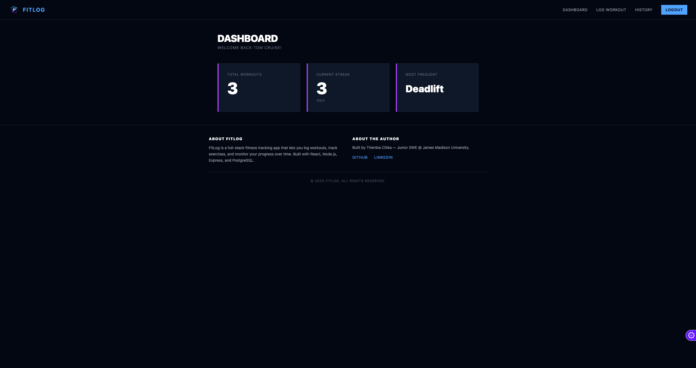
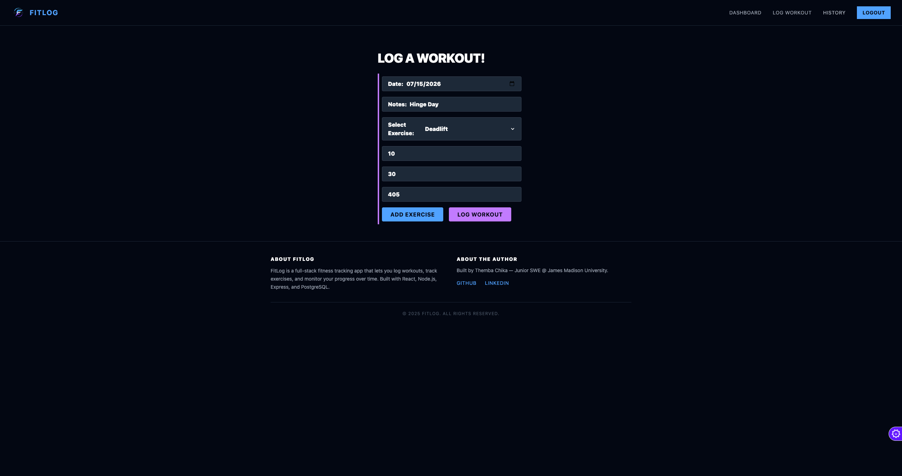

# FitLog

A full-stack fitness tracker. Log workouts, track exercises, and watch your streak grow.

Built with **React 19 + Vite + Tailwind CSS 4** on the frontend and **Node.js + Express 5 + PostgreSQL** on the backend, with JWT authentication.

<!-- TODO: replace with real screenshots -->

<!--  -->

<!--  -->

## Features

- **Account system**: register/login with bcrypt-hashed passwords and 7-day JWTs
- **Workout logging**: pick from a seeded exercise catalog, queue multiple exercises with sets/reps/weight, and submit as one atomic workout (transactional insert)
- **Workout history**: grouped by workout, newest first, with delete
- **Dashboard stats**: total workouts, most frequent exercise, and a timezone-aware daily streak
- **Security**: helmet headers, CORS whitelist, rate-limited auth endpoints, server-side input validation, parameterized SQL throughout

## Architecture

```
client (React + Vite)                server (Express)              PostgreSQL
┌──────────────────────┐   axios    ┌──────────────────────┐      ┌──────────────┐
│ pages/    Login       │ ────────▶ │ routes/  authRoutes   │      │ users         │
│           Signup      │  JWT in   │          workoutRoutes│ ───▶ │ workouts      │
│           Dashboard   │  header   │          exerciseRts  │  pg  │ workout_      │
│           LogWorkout  │           │          statRoutes   │      │   exercises   │
│           History     │           │ middleware/requireAuth│      │ exercises     │
│ utils/    api, auth   │           │ controllers + utils   │      └──────────────┘
└──────────────────────┘           └──────────────────────┘
```

## API

All routes except `/api/auth/*` and `/api/health` require an `Authorization: Bearer <token>` header.

| Method | Endpoint             | Description                                    |
|--------|----------------------|------------------------------------------------|
| POST   | `/api/auth/register` | Create an account, returns `{ user, token }`   |
| POST   | `/api/auth/login`    | Log in, returns `{ user, token }`              |
| GET    | `/api/exercises`     | List the exercise catalog                      |
| GET    | `/api/workouts`      | List the user's workouts with exercises        |
| POST   | `/api/workouts`      | Log a workout (transactional)                  |
| DELETE | `/api/workouts/:id`  | Delete an owned workout                        |
| GET    | `/api/stats`         | Totals, most frequent exercise, streak (`?today=YYYY-MM-DD` for timezone-correct streaks) |
| GET    | `/api/health`        | Health check                                   |

## Getting started

Prerequisites: Node 20+, PostgreSQL 14+.

```bash
git clone https://github.com/ayeethemba/fitlog.git
cd fitlog

# 1. Database
createdb fitlog
psql fitlog -f server/db/schema.sql

# 2. Server
cd server
cp .env.example .env        # fill in DATABASE_URL and JWT_SECRET
npm install
npm run dev                 # http://localhost:3000

# 3. Client (new terminal)
cd client
npm install
npm run dev                 # http://localhost:5173
```

### Environment variables (server/.env)

| Variable       | Description                                          |
|----------------|------------------------------------------------------|
| `PORT`         | API port (default 3000)                              |
| `DATABASE_URL` | PostgreSQL connection string                         |
| `JWT_SECRET`   | Long random string used to sign tokens              |
| `CLIENT_URL`   | Deployed frontend origin for the CORS whitelist      |

The client reads `VITE_API_URL` (defaults to `http://localhost:3000`).

## Testing

```bash
cd server
npm test
```

Jest + Supertest cover auth validation, error-message hygiene, the workout transaction (commit and rollback paths), ownership checks, and the streak algorithm. CI runs tests, lint, and a production build on every push via GitHub Actions.

## Deployment

- **Client**: Vercel (SPA rewrites configured in `client/vercel.json`)
- **Server**: any Node host (Render, Railway, Fly.io); set the env vars above
- **Database**: managed PostgreSQL (Neon, Supabase, Render)

## Author

**Themba Chika** — [GitHub](https://github.com/ayeethemba) · [LinkedIn](https://www.linkedin.com/in/thembachika)
